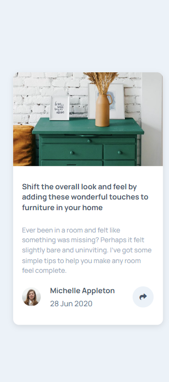
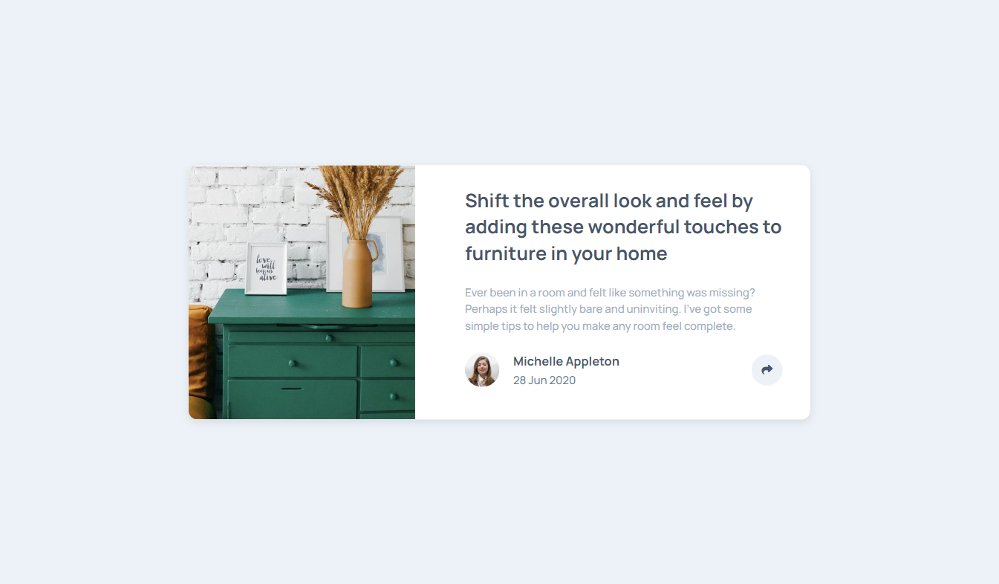

# Frontend Mentor - Article preview component solution

This is a solution to the [Article preview component challenge on Frontend Mentor](https://www.frontendmentor.io/challenges/article-preview-component-dYBN_pYFT). Frontend Mentor challenges help you improve your coding skills by building realistic projects. 

## Overview

### The challenge

Users should be able to:

- View the optimal layout for the component depending on their device's screen size
- See the social media share links when they click the share icon

### Screenshot

### Built with

- Semantic HTML5 markup
- CSS custom properties
- Flexbox
- CSS Grid
- Mobile-first workflow
- bootstrap 5

### What I learned

i learnd from this design a lot of things like the property "clip-path" and, also i got the chance to practice more and more of the concepts of the css

### Useful resources

- [clippath](https://bennettfeely.com/clippy/) - This helped me a lot for the cut an area of image 
- [rest Css](https://www.joshwcomeau.com/) -  This website helped me a lot with the reset css ,it's save the time rather than do it by your self

## Author
- Frontend Mentor - [@Yassineafaila](https://www.frontendmentor.io/profile/Yassineafaila)
- Twitter - [@AfailaYassine](https://twitter.com/AfailaYassine)

